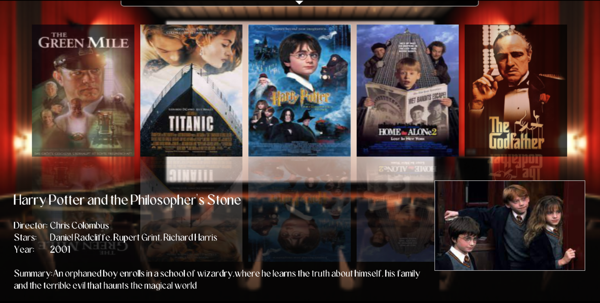
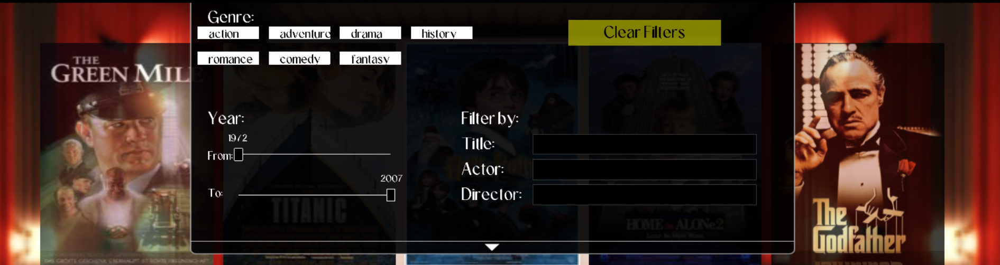

# Film Browser C++ Application

## Overview

Welcome to the Film Browser C++ application! This application leverages the power of the Simple Game Graphics (SGG) library to provide a visually engaging experience for movie enthusiasts. It offers a slider-based interface to seamlessly explore a vast collection of movies while delivering detailed information about the active movie. Additionally, the application includes a versatile search feature, allowing users to search for movies based on their release year, genre, and textual criteria.

## Features

- **Interactive Slider:** Explore a diverse range of movies with ease using an intuitive slider interface.

- **Movie Details:** Get comprehensive information about the active movie, including its title, release year, director, actors, a brief description and a couple of images.

- **Dropdown (Dock) for Search:** The search functionality is conveniently accessible via a dropdown that appears when the mouse enters its region. This provides an unobtrusive and efficient way to initiate searches.

- **Search Functionality:** Quickly locate movies based on different criteria:
  - Search by year: Find movies released in a specific year or within a range of years.
  - Search by genre: Discover movies belonging to your preferred genre.
  - Text Search: Use keywords to search for movies by title, actors, or director.

## Usage
To use the Film Browser application, follow these steps:

1. **Download the Application:**

   - Download the application files from the [Repository](https://github.com/Ippo03/FilmBrowser_SGG) on GitHub.
   - Extract the downloaded archive to a folder of your choice.

2. **Navigate to the 'bin' Folder:**

   - Open the folder where you extracted the application files.
   - Inside this folder, you will find a subfolder named 'bin.' Navigate to it.

3. **Run the Film Browser:**

   - Locate the `FilmBrowser` executable file.
   - Double-click on the `FilmBrowser` executable to run the application.
   - You are all set!!!

